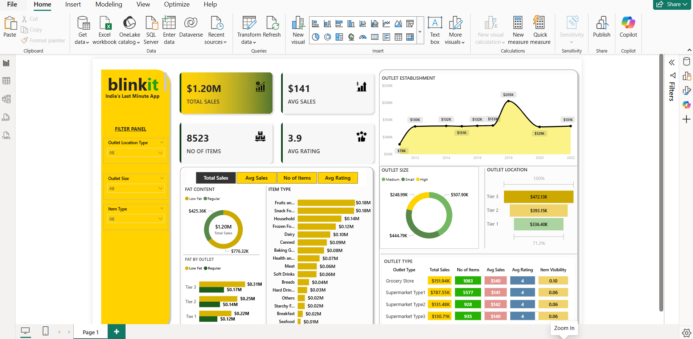

# Blinkit Grocery Sales Dashboard  

This project is a Power BI dashboard created to analyze Blinkit’s grocery sales data.  
It helps track sales performance, key KPIs, and outlet-wise insights.  

## Project Highlights  
- Covers product sales, outlet performance, and customer ratings.  
- Shows important KPIs like total sales, average sales, and rating trends.  
- Helps identify top performing outlets and underperforming categories.  

## Tools Used  
- Power BI for dashboard and visuals  
- Excel/CSV as dataset  

## Files  
- `Blinkit Grocery Sales Dashboard.pbix` → Dashboard file  
- `BlinkIT Grocery Data.csv` → Dataset  

## Dashboard Preview  

